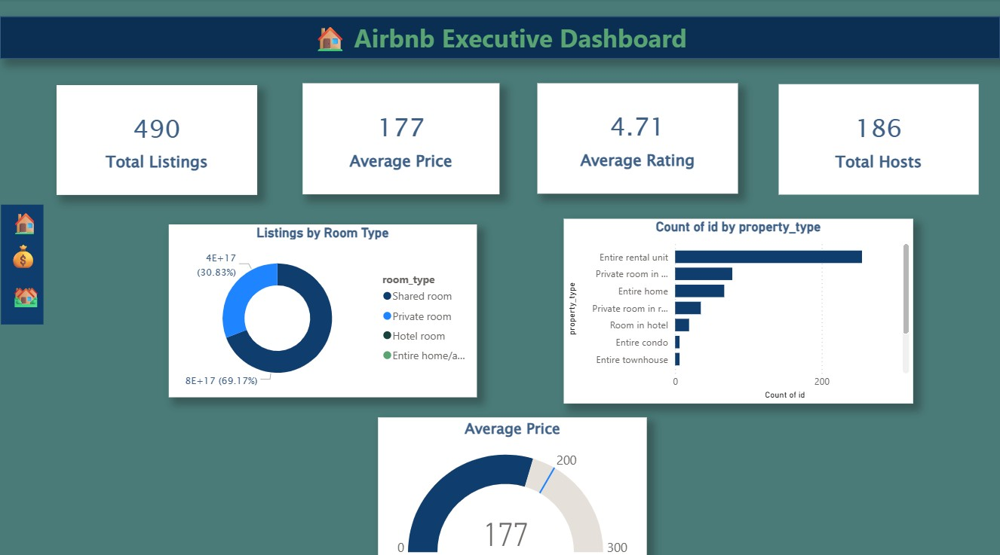
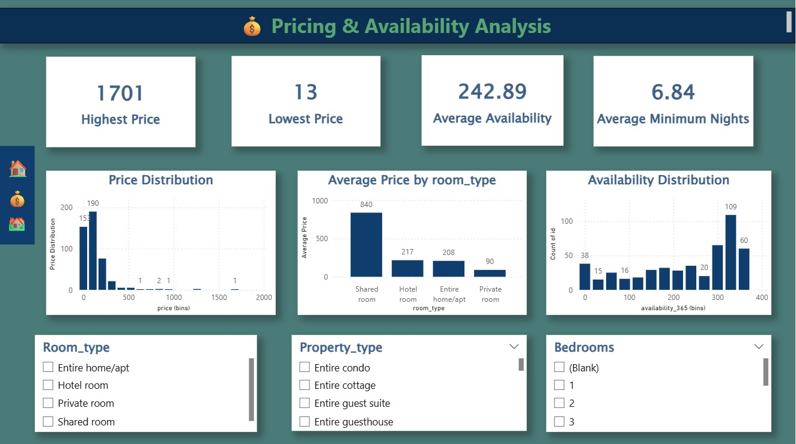
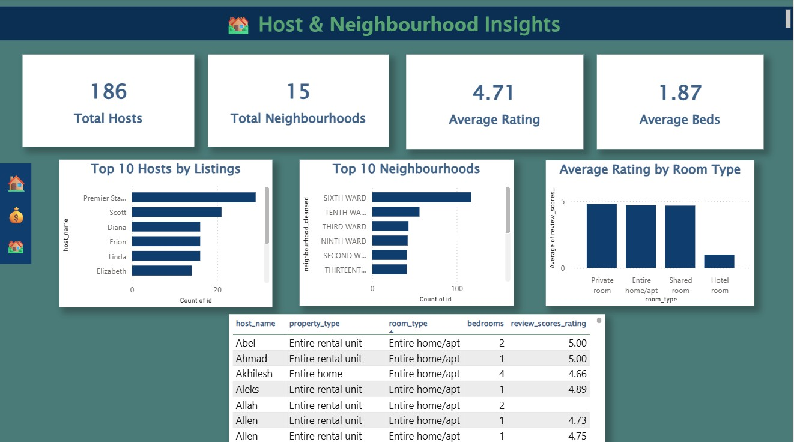

# 🏠 Airbnb Data Analytics Dashboard


## 📌 Project Overview

This project analyzes Airbnb listing data using **MySQL** for data preparation and **Power BI** for interactive dashboard creation.

The dashboard helps understand pricing trends, room types, host performance, neighbourhood distribution, and customer ratings.

---

## 🎯 Objectives

- Analyze Airbnb listings
- Study room type distribution
- Compare property types
- Analyze pricing trends
- Evaluate host performance
- Explore neighbourhood insights
- Build an interactive dashboard

---

## 🛠️ Tools & Technologies

- Power BI Desktop
- MySQL
- SQL
- Microsoft Excel
- GitHub

---

## 📂 Dataset

The dataset contains Airbnb listing information including:

- Listing ID
- Host Details
- Property Type
- Room Type
- Price
- Bedrooms
- Bathrooms
- Availability
- Ratings
- Neighbourhood

---

# 📊 Dashboard Pages

## 🏠 Page 1 – Executive Overview

Features:

- Total Listings
- Average Price
- Average Rating
- Total Hosts
- Listings by Room Type
- Top Property Types
- Gauge Chart
- Interactive Slicers

---

## 💰 Page 2 – Pricing & Availability Analysis

Features:

- Price Distribution
- Average Price by Room Type
- Average Price by Bedrooms
- Availability Distribution
- Top Expensive Listings
- Interactive Filters

---

## 🏘️ Page 3 – Host & Neighbourhood Insights

Features:

- Top Hosts
- Top Neighbourhoods
- Average Ratings
- Host Details Table
- Interactive Filters

---

# 📈 Key Insights

- Entire homes are the most common room type.
- A small number of hosts manage many listings.
- Some neighbourhoods command significantly higher average prices.
- Higher-rated listings generally receive more reviews.

---

# 📁 Repository Structure

```text
Airbnb-Data-Analytics
│
├── Data
│
├── SQL
│
├── PowerBI
│
├── Images
│
├── Dashboard.pdf
│
└── README.md
```

---

# 📷 Dashboard Screenshots


## 🏠 Executive Overview




---


## 💰 Pricing & Availability Analysis



---

## 🏘️ Host & Neighbourhood Insights



---

# 🚀 Future Improvements

- Predictive price analysis
- Occupancy forecasting
- Sentiment analysis of reviews
- Time-series analysis
- Advanced DAX measures

---


---


